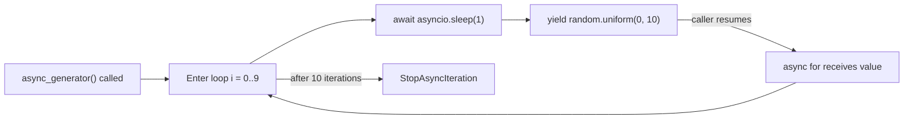
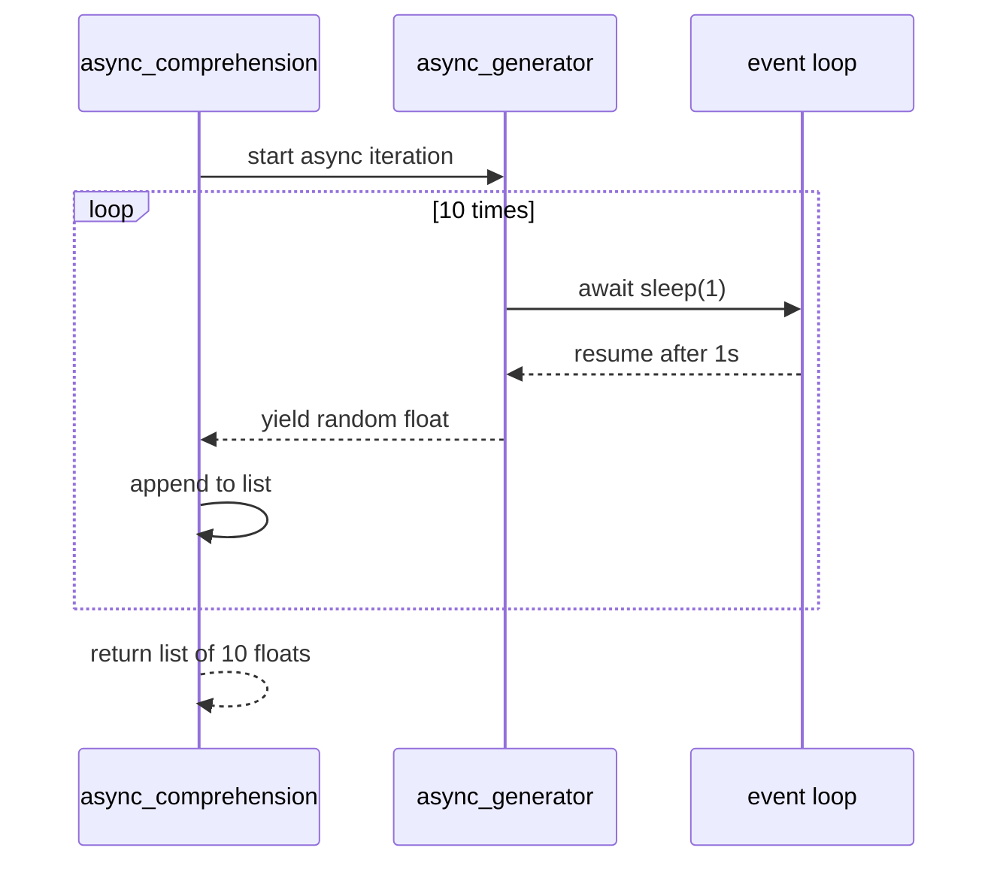
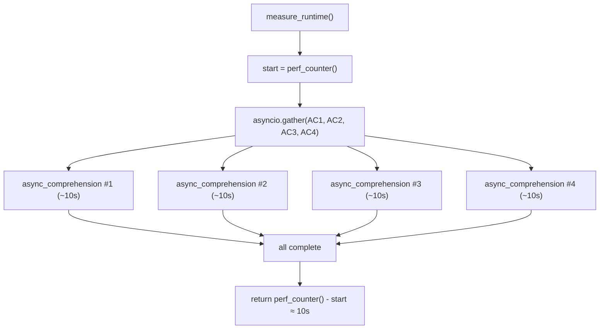

# Python Async Comprehension

This project introduces asynchronous generators and async comprehensions in
Python, then measures how parallel async comprehensions behave with
asyncio.gather.

## Learning Objectives

- How to write an asynchronous generator.
- How to use async comprehensions.
- How to type-annotate generators.

## Requirements

- Ubuntu 20.04 LTS
- Python 3.9
- pycodestyle 2.5.x
- First line in each Python file: #!/usr/bin/env python3
- All files are executable.
- All modules, functions, and coroutines include real-sentence docstrings.
- All functions and coroutines are type-annotated.
- File lengths are validated with wc.

## Project Structure

| File | Signature | Description |
| --- | --- | --- |
| 0-async_generator.py | async_generator() -> Generator[float, None, None] | Yields ten random floats after one-second awaits |
| 1-async_comprehension.py | async_comprehension() -> List[float] | Collects generator values using async comprehension |
| 2-measure_runtime.py | measure_runtime() -> float | Runs four comprehensions concurrently and measures elapsed time |

## Task-by-Task Explanation

### Task 0: async_generator

Problem:
Build an async generator that emits random values over time.

Solution:
Use a loop of ten iterations, await asyncio.sleep(1), and yield
random.uniform(0, 10) each time.

Why it works:
The function is asynchronous and yields lazily, so values are produced one at a
time while the event loop can schedule other work during sleeps.

### Task 1: async_comprehension

Problem:
Consume all values from async_generator and return them as a list.

Solution:
Use an async comprehension directly over async_generator().

Why it works:
async for drives asynchronous iteration correctly and collects each yielded
value into a standard Python list.

### Task 2: measure_runtime

Problem:
Measure how long four async comprehensions take when run in parallel.

Solution:
Capture start time, await asyncio.gather with four async_comprehension calls,
then return the elapsed float duration.

Why it works:
Each comprehension spends most time awaiting sleep, and gather overlaps waits,
so wall-clock time is near a single comprehension duration.

## Mermaid Diagrams

### Flowchart: async_generator lifecycle



### Sequence diagram: async comprehension consuming the generator



### Flowchart: measure_runtime runs 4 comprehensions in parallel



Total runtime is ~10s (not 40s) because the four comprehensions run
concurrently on the same event loop and the asyncio.sleep(1) calls overlap.

## How to Test Manually

### Task 0

```bash
chmod +x 0-async_generator.py 0-main.py
./0-main.py
```

Expected stdout pattern:

```text
4.72...
9.10...
0.34...
7.88...
```

### Task 1

```bash
chmod +x 1-async_comprehension.py 1-main.py
./1-main.py
```

Expected stdout pattern:

```text
[2.11..., 5.44..., 9.03..., 0.87..., 7.16..., 6.50..., 3.40..., 8.22..., 1.97..., 4.66...]
```

### Task 2

```bash
chmod +x 2-measure_runtime.py 2-main.py
./2-main.py
```

Expected stdout pattern:

```text
10.0...
```

## Docstring Verification

```bash
python3 -c 'print(import("0-async_generator").doc)'
python3 -c 'print(import("0-async_generator").async_generator.doc)'
python3 -c 'print(import("1-async_comprehension").async_comprehension.doc)'
python3 -c 'print(import("2-measure_runtime").measure_runtime.doc)'
```

## Pycodestyle Verification

```bash
pycodestyle --version   # should be 2.5.x
pycodestyle 0-async_generator.py 1-async_comprehension.py 2-measure_runtime.py
```

## Key Takeaways

- A regular generator yields values synchronously, while an async generator can
await between yields and must run under an event loop.
- async for is required because async generators implement asynchronous
iteration, not synchronous iteration.
- [i async for i in async_generator()] must be inside async def because async
comprehensions require an asynchronous context.
- Four parallel async_comprehension calls take about 10 seconds instead of 40
seconds because their wait periods overlap concurrently.

## Author

Abdallah Yessine Kriaa

Holberton SAU-0225
