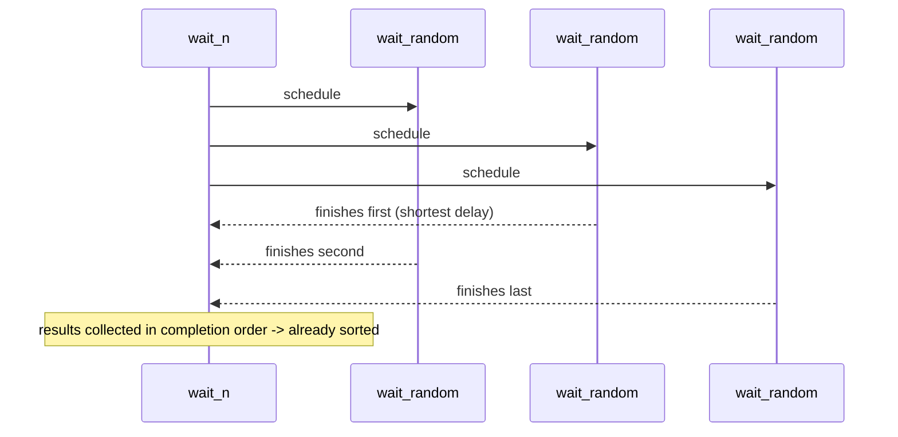
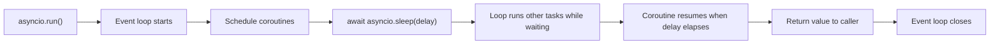
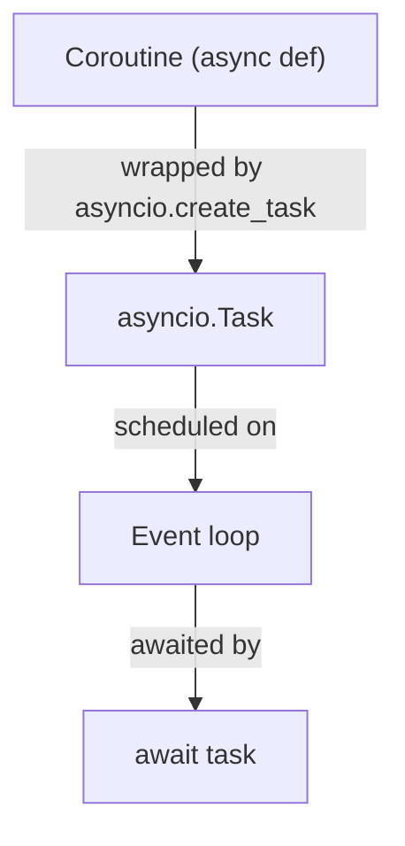

# Python Async Function

This project introduces asynchronous programming in Python using coroutines,
the asyncio event loop, concurrent execution, and asyncio tasks.

## Learning Objectives

- Use async and await syntax correctly.
- Execute an async program with asyncio.
- Run concurrent coroutines.
- Create and manage asyncio tasks.
- Use the random module with async workflows.

## Requirements

- Ubuntu 20.04 LTS
- Python 3.9
- pycodestyle 2.5.x
- First line in every Python file: #!/usr/bin/env python3
- All Python files are executable.
- All modules and functions include real-sentence docstrings.
- All functions and coroutines are type-annotated.
- Every file ends with a newline.

## Project Structure

| File | Signature | Purpose |
| --- | --- | --- |
| 0-basic_async_syntax.py | async wait_random(max_delay: int = 10) -> float | Sleep for a random delay and return it |
| 1-concurrent_coroutines.py | async wait_n(n: int, max_delay: int) -> List[float] | Run n coroutines concurrently and collect completion-order delays |
| 2-measure_runtime.py | measure_time(n: int, max_delay: int) -> float | Measure average runtime per coroutine |
| 3-tasks.py | task_wait_random(max_delay: int) -> asyncio.Task | Wrap wait_random in asyncio.create_task |
| 4-tasks.py | async task_wait_n(n: int, max_delay: int) -> List[float] | Run n tasks concurrently and collect completion-order delays |

## Task-by-Task Explanation

### Task 0: wait_random

Problem:
Return a random delay asynchronously.

Solution:
Generate a delay with random.uniform, await asyncio.sleep(delay), and return
the delay.

Why it works:
The coroutine yields control while sleeping, so the event loop can schedule
other work.

### Task 1: wait_n

Problem:
Run wait_random n times concurrently and return delays in ascending order
without calling sort.

Solution:
Create n wait_random coroutines and iterate over asyncio.as_completed to append
results in completion order.

Why it works:
Shorter delays finish earlier, so completion order naturally yields an
ascending list of delays.

### Task 2: measure_time

Problem:
Measure average runtime per coroutine.

Solution:
Record start time, run wait_n with asyncio.run, then divide elapsed time by n.

Why it works:
Coroutines run concurrently, so total time trends toward the longest delay,
not the sum of all delays.

### Task 3: task_wait_random

Problem:
Return an asyncio.Task instead of a bare coroutine.

Solution:
Wrap wait_random(max_delay) with asyncio.create_task.

Why it works:
asyncio.create_task schedules the coroutine immediately on the running loop and
returns a Task handle.

### Task 4: task_wait_n

Problem:
Run many task objects concurrently and return delays in ascending order.

Solution:
Create tasks with task_wait_random and collect completed values via
asyncio.as_completed.

Why it works:
Tasks are scheduled concurrently, and completed results are consumed in finish
order.

## Mermaid Diagrams

### Sequence Diagram: concurrent coroutines with asyncio.as_completed



### Flowchart: event loop and coroutine lifecycle



### Class-ish diagram: coroutine vs task



## How to Test Manually

### Task 0

```bash
chmod +x 0-basic_async_syntax.py 0-main.py
./0-main.py
```

Expected stdout example:

```text
9.034261504534394
1.6216525464615306
10.634589756751769
```

### Task 1

```bash
chmod +x 1-concurrent_coroutines.py 1-main.py
./1-main.py
```

Expected stdout pattern:

```text
[0.23..., 0.88..., 1.67..., 2.91..., 4.75...]
```

### Task 2

```bash
chmod +x 2-measure_runtime.py 2-main.py
./2-main.py
```

Expected stdout pattern:

```text
1.3...
```

### Task 3

```bash
chmod +x 3-tasks.py 3-main.py
./3-main.py
```

Expected stdout pattern:

```text
<class '_asyncio.Task'>
2.4...
```

### Task 4

```bash
chmod +x 4-tasks.py 4-main.py
./4-main.py
```

Expected stdout pattern:

```text
[0.18..., 0.62..., 1.55..., 3.07..., 4.94...]
```

## Docstring Verification

```bash
python3 -c 'print(__import__("0-basic_async_syntax").__doc__)'
python3 -c 'print(__import__("0-basic_async_syntax").wait_random.__doc__)'
python3 -c 'print(__import__("1-concurrent_coroutines").__doc__)'
python3 -c 'print(__import__("1-concurrent_coroutines").wait_n.__doc__)'
python3 -c 'print(__import__("2-measure_runtime").__doc__)'
python3 -c 'print(__import__("2-measure_runtime").measure_time.__doc__)'
python3 -c 'print(__import__("3-tasks").__doc__)'
python3 -c 'print(__import__("3-tasks").task_wait_random.__doc__)'
python3 -c 'print(__import__("4-tasks").__doc__)'
python3 -c 'print(__import__("4-tasks").task_wait_n.__doc__)'
```

## Key Takeaways

- A coroutine is an awaitable function call from async def, while a task is a
scheduled coroutine managed by the event loop.
- asyncio.as_completed yields awaitables as soon as each finishes, so wait
durations are collected from shortest to longest.
- measure_time tends toward max_delay / 2 / n for uniform random delays because
the work runs concurrently rather than sequentially.

## Author

Abdallah Yessine Kriaa

Holberton SAU-0225
