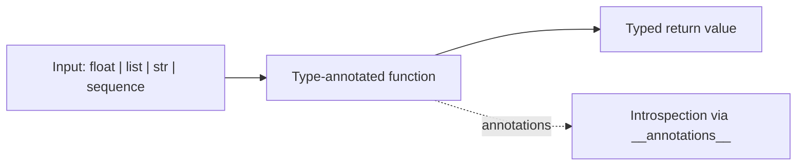
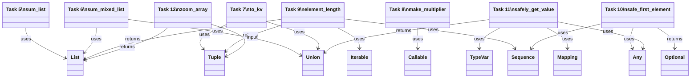
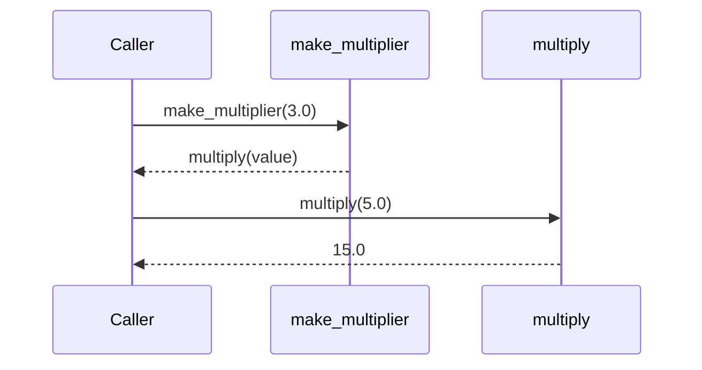

# Python Variable Annotations

This project practices Python variable and function annotations based on PEP 484,
using explicit type hints to describe inputs and outputs in a readable way.

## Learning Objectives

- Understand and apply type annotations in Python.
- Use the typing module primitives for richer function signatures.
- Explain duck typing with Iterable and Sequence based contracts.
- Use TypeVar to model relationships between default values and return types.
- Validate annotation-focused code quality with pycodestyle.

## Requirements

- Ubuntu 18.04 LTS
- Python 3.7
- pycodestyle 2.5
- Every Python file starts with #!/usr/bin/env python3
- Every file is executable
- Every module and function includes a real-sentence docstring
- Every file ends with a newline

## Project Structure

| File | Signature | Expected Output |
| --- | --- | --- |
| 2-floor.py | floor(n: float) -> int | floor(3.14) is 3 and annotations show float -> int |
| 3-to_str.py | to_str(n: float) -> str | to_str(3.14) is '3.14' and annotations show float -> str |
| 4-define_variables.py | a: int, pi: float, i_understand_annotations: bool, school: str | Values and runtime types match definitions |
| 5-sum_list.py | sum_list(input_list: List[float]) -> float | Sum returned as float with List[float] annotation |
| 6-sum_mixed_list.py | sum_mixed_list(mxd_lst: List[Union[int, float]]) -> float | Mixed numeric sum returned as float |
| 7-to_kv.py | to_kv(k: str, v: Union[int, float]) -> Tuple[str, float] | Returns (k, float(v * v)) |
| 8-make_multiplier.py | make_multiplier(multiplier: float) -> Callable[[float], float] | Returns closure multiplying by multiplier |
| 9-element_length.py | element_length(lst: Iterable[Sequence]) -> List[Tuple[Sequence, int]] | Returns (element, len(element)) pairs |
| 100-safe_first_element.py | safe_first_element(lst: Sequence[Any]) -> Optional[Any] | Returns first element or None for empty sequences |
| 101-safely_get_value.py | safely_get_value(dct: Mapping, key: Any, default: Optional[T] = None) -> Union[Any, T] | Returns mapping value when present, else typed default |
| 102-type_checking.py | zoom_array(lst: Tuple, factor: int = 2) -> List | Passes mypy and returns repeated list values |

## Task-by-Task Explanation

### Task 2: floor

This task enforces a simple numeric conversion contract.
The function accepts a float and returns an int from math.floor.
The annotation communicates that truncation direction is flooring, not casting.

### Task 3: to_str

This task shows scalar type transformation.
The function takes a float and returns its string representation.
The annotation makes conversion intent explicit to readers and tools.

### Task 4: define variables

This task introduces variable annotations at module scope.
Each variable has both an annotated type and a concrete literal value.
The result demonstrates how static intent and runtime value coexist.

### Task 5: sum_list

This task introduces List[float] from typing.
The function sums float inputs and returns a float.
Using List[float] documents homogeneous list expectations.

### Task 6: sum_mixed_list

This task extends list typing with Union[int, float].
The function accepts mixed numeric values and still returns float.
Union captures flexible inputs while preserving output consistency.

### Task 7: to_kv

This task combines Union and Tuple typing.
A string key and numeric value become a tuple of key and squared float.
Tuple[str, float] documents fixed positional output semantics.

### Task 8: make_multiplier

This task demonstrates higher-order typing with Callable.
The outer function returns a closure that multiplies input by multiplier.
Callable[[float], float] explains the returned function contract.

### Task 9: element_length

This task demonstrates duck typing through Iterable and Sequence.
Any iterable of sequence-like items is accepted as input.
The function returns tuples of each element with its computed length.

### Task 10: safe_first_element

This task uses duck typing with Sequence[Any].
The function safely reads the first element only when the sequence is not empty.
Optional[Any] models that None can be returned when no element exists.

### Task 11: safely_get_value

This task introduces TypeVar for default-value typing.
The function accepts a generic mapping and returns either a stored value or default.
The return annotation Union[Any, T] reflects both possible execution paths.

### Task 12: type checking

This task aligns annotations with runtime behavior and mypy validation.
The function signature advertises Tuple input, int factor, and List return.
Inputs and call sites are updated so static type checking succeeds.

## Mermaid Diagrams

### Flowchart



### Typing Relationship Diagram



### Sequence Diagram for Task 8



## How to Test Manually

### Task 2

```bash
chmod +x 2-floor.py 2-main.py
./2-main.py
```

Expected stdout:

```text
3
{'n': <class 'float'>, 'return': <class 'int'>}
```

### Task 3

```bash
chmod +x 3-to_str.py 3-main.py
./3-main.py
```

Expected stdout:

```text
3.14
{'n': <class 'float'>, 'return': <class 'str'>}
```

### Task 4

```bash
chmod +x 4-define_variables.py 4-main.py
./4-main.py
```

Expected stdout:

```text
1
3.14
True
Holberton
<class 'int'>
<class 'float'>
<class 'bool'>
<class 'str'>
```

### Task 5

```bash
chmod +x 5-sum_list.py 5-main.py
./5-main.py
```

Expected stdout:

```text
6.0
{'input_list': typing.List[float], 'return': <class 'float'>}
```

### Task 6

```bash
chmod +x 6-sum_mixed_list.py 6-main.py
./6-main.py
```

Expected stdout:

```text
6.5
{'mxd_lst': typing.List[typing.Union[int, float]], 'return': <class 'float'>}
```

### Task 7

```bash
chmod +x 7-to_kv.py 7-main.py
./7-main.py
```

Expected stdout:

```text
('school', 36.0)
{'k': <class 'str'>, 'v': typing.Union[int, float], 'return': typing.Tuple[str, float]}
```

### Task 8

```bash
chmod +x 8-make_multiplier.py 8-main.py
./8-main.py
```

Expected stdout:

```text
15.0
{'multiplier': <class 'float'>, 'return': typing.Callable[[float], float]}
```

### Task 9

```bash
chmod +x 9-element_length.py 9-main.py
./9-main.py
```

Expected stdout:

```text
[('Hello', 5), ('World', 5), ('Python', 6)]
{'lst': typing.Iterable[typing.Sequence], 'return': typing.List[typing.Tuple[typing.Sequence, int]]}
```

### Task 10

```bash
chmod +x 100-safe_first_element.py 100-main.py
./100-main.py
```

Expected stdout:

```text
{'lst': typing.Sequence[typing.Any], 'return': typing.Optional[typing.Any]}
```

### Task 11

```bash
chmod +x 101-safely_get_value.py 101-main.py
./101-main.py
```

Expected stdout:

```text
Here's what the mappings should look like
dct: typing.Mapping
key: typing.Any
default: typing.Union[~T, NoneType]
return: typing.Union[typing.Any, ~T]
```

### Task 12

```bash
chmod +x 102-type_checking.py 102-main.py
mypy 102-type_checking.py
./102-main.py
```

Expected stdout:

```text
Success: no issues found in 1 source file
{'lst': typing.Tuple, 'factor': <class 'int'>, 'return': typing.List}
```

## Author

Abdallah Yessine Kriaa

Holberton SAU-0225
